# Automated Figma Plugin Deployment

This project supports automated deployment to Figma Community using the [figma-plugin-deploy](https://github.com/typper-io/figma-plugin-deploy) GitHub Action.

## Setup Instructions

### 1. Get Your Figma Plugin ID and Team ID

1. Go to your plugin in Figma
2. Open the plugin details/settings
3. Find your Plugin ID (usually in the URL or settings)
4. Find your Team ID (in team settings or URL)

### 2. Set Up 2FA for Automated Access

The deployment action requires a TOTP (Time-based One-Time Password) secret for 2FA:

1. If you already have 2FA enabled:
   - You'll need to temporarily disable and re-enable it to get the secret
   - Go to Figma Account Settings → Security

2. When enabling 2FA:
   - Choose "Authenticator App"
   - **Important**: Save the secret key/QR code text that Figma provides
   - This is your `FIGMA_TOTP_SECRET`

3. Complete the 2FA setup with your authenticator app

### 3. Configure GitHub Secrets

Add the following secrets to your repository:
(Settings → Secrets and variables → Actions → New repository secret)

Required secrets:

- `FIGMA_EMAIL`: Your Figma account email
- `FIGMA_PASSWORD`: Your Figma account password
- `FIGMA_TOTP_SECRET`: The 2FA secret from step 2

Note: Both Plugin ID and Team ID are stored in your `manifest.json` file:

```json
{
  "id": "1534296567356005263", // Your plugin ID
  "teamId": "1103095995612849334" // Your team ID
}
```

### 4. How It Works

When you create a new release tag (e.g., `v1.2.3`):

1. Push a tag: `git tag v1.2.3 && git push origin v1.2.3`
2. The release workflow automatically:
   - Builds the plugin
   - Creates a GitHub release
   - Deploys to Figma Community (if not a beta/alpha)
   - Includes release notes from commit messages

### 5. Manual Deployment Fallback

If automated deployment fails, the workflow will provide manual publishing instructions in the GitHub Actions summary.

## Security Considerations

- All credentials are stored as encrypted GitHub secrets
- The action uses secure authentication with Figma
- Passwords and secrets are never exposed in logs
- Consider using a dedicated Figma account for deployments
- Regularly rotate your credentials

## Deployment Workflow

```mermaid
graph TD
    A[Push Tag v1.2.3] --> B[GitHub Actions Triggered]
    B --> C[Build Plugin]
    C --> D[Run Tests]
    D --> E[Create GitHub Release]
    E --> F{Is Beta/Alpha?}
    F -->|No| G[Deploy to Figma]
    F -->|Yes| H[Skip Figma Deploy]
    G --> I{Success?}
    I -->|Yes| J[✅ Published]
    I -->|No| K[📋 Manual Steps Provided]
```



## Troubleshooting

### Deployment Fails

1. Check GitHub Actions logs for specific errors
2. Verify all secrets are correctly set
3. Ensure 2FA is properly configured
4. Try manual deployment as a fallback

### Common Issues

- **Authentication Failed**: Double-check email, password, and TOTP secret
- **Plugin Not Found**: Verify the plugin ID in manifest.json is correct
- **Team Not Found**: Verify FIGMA_TEAM_ID is correct
- **2FA Issues**: Regenerate and update FIGMA_TOTP_SECRET

### Testing Deployment

To test without affecting production:

1. Create a test plugin in Figma
2. Use test plugin credentials in a separate environment
3. Push a test tag like `v0.0.1-test`

## Version Numbering

Follow semantic versioning:

- `v1.0.0` - Major release (breaking changes)
- `v1.1.0` - Minor release (new features)
- `v1.1.1` - Patch release (bug fixes)
- `v1.1.0-beta.1` - Beta release (not deployed to Figma)
- `v1.1.0-alpha.1` - Alpha release (not deployed to Figma)

## Manual Release Process

If you prefer manual releases or automated deployment is not set up:

1. Build the plugin: `npm run build`
2. Go to [Figma Plugin Publish](https://www.figma.com/plugin-docs/publish-plugins/)
3. Upload your plugin files
4. Add release notes
5. Submit for review
